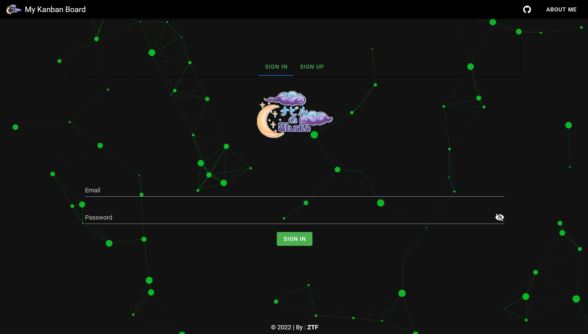
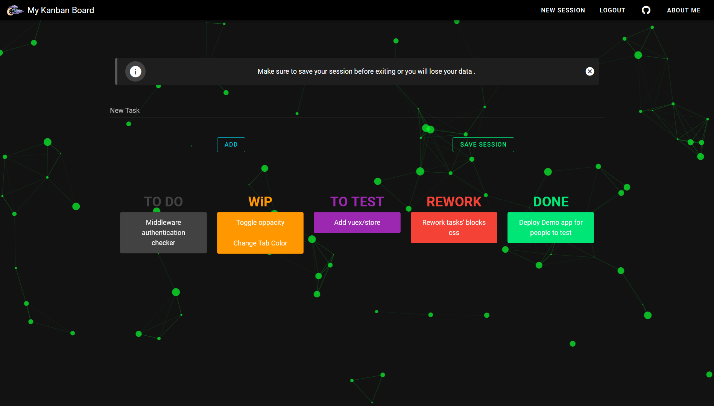
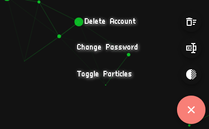

# My Kanban Board

<div align="center">
A more simplified rendition of my own kanban board, which i use to track stuff when i'm working on something .
 
<p>Tech used in the making :</p>


</div>

## Demo

<div align="center">


</div>

## UPDATE V1.0

| Features       | status |
| -------------- | ------ |
| Add tasks      | ✅     |
| Delete Session | ✅     |
| Save Session   | ✅     |

## UPDATE V2.0

| Features                   | status |
| -------------------------- | ------ |
| Login                      | ✅     |
| Logout                     | ✅     |
| Register                   | ✅     |
| Unique Collection per user | ✅     |
| Error Handeling make over  | ✅     |
| Tasks' css overhaul        | ✅     |

## UPDATE V2.5

| Features                   | status |
| -------------------------- | ------ |
| Change Password            | ✅     |
| Reset Forgotten Password   | ✅     |
| Toned down vibrant colours | ✅     |
| Toggle Particles On/Off    | ✅     |
| Floating Control Button    | ✅     |
| Cleaner Code               | ✅     |

## UPDATE V2.6

| Features           | status |
| ------------------ | ------ |
| Delete Account     | ✅     |
| Delete Single Task | ✅     |

<div align="center">

</div>

### Deleting Tasks

<div align="center">
Double Clicking on a task will delete it from the array it's in , if you do not save your session aka save your data to the firestore, that action won't be taken into consideration .
</div>

### How To Use

```bash
# install dependencies
$ npm install

# serve with hot reload at localhost:3000
$ npm run dev

# build for production and launch server
$ npm run build
$ npm run start

# generate static project
$ npm run generate
```

### Firebase Project Config

#### Config File location :

📦firebase-config  
 ┣ 📜config.js  
 ┗ 📜firestore.js

<p>Copy/Paste your config from the firebase console into the config.js file : </p>

```js
var firebaseConfig = {
  apiKey: 'XXXXXXXXXXXXXX',
  authDomain: 'XXXXXXXXXXXXXX',
  projectId: 'XXXXXXXXXXXXXX',
  storageBucket: 'XXXXXXXXXXXXXX',
  messagingSenderId: 'XXXXXXXXXXXXXX',
  appId: 'XXXXXXXXXXXXXX',
  measurementId: 'XXXXXXXXXXXXXX',
}
```

## Heresy warning :

### The Code :

<p><small>
Iam aware of my <strong>unconventional</strong> approach to using firebase config this way , so please feel free to use it how you normally would in your projects .<br>
The quality of the code isn't amazing nor it is great , I'm still polishing my js skills.
</small>
</p>

### The App :

<p><small>
It's not mobile friendly.
</small>
</p>

# Contact

<div align="center">
<p>you can contact me at ZTF666@protonmail.ch or via my portfolio</p>

</div>

<div align="center">

<table>
  <tr>
    <td align="center"><a href="https://ztfportfolio.web.app/" target='_blank'><br /><sub><b>ZTF666</b></sub></a></td>
  </tr>
  <tr>
    <td align="center"><a href="https://www.paypal.com/paypalme/ztf666" target='_blank'><br /><sub><b>Donations</b></sub></a></td>
  </tr>
</table>

</div>

## License

<div align="center">

**My Kanban Board**
released under the [MIT](LICENSE) License.
<br><br>

<strong><p>Made with 🖤 by ZTF - N.EA | 2022 </p> </strong>

</div>
